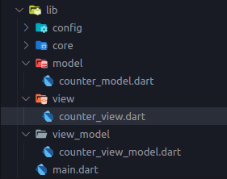
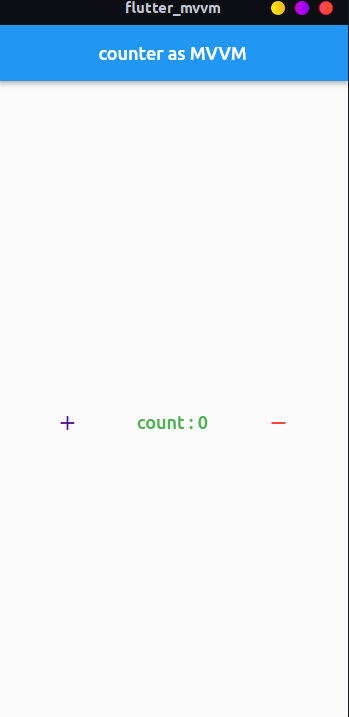
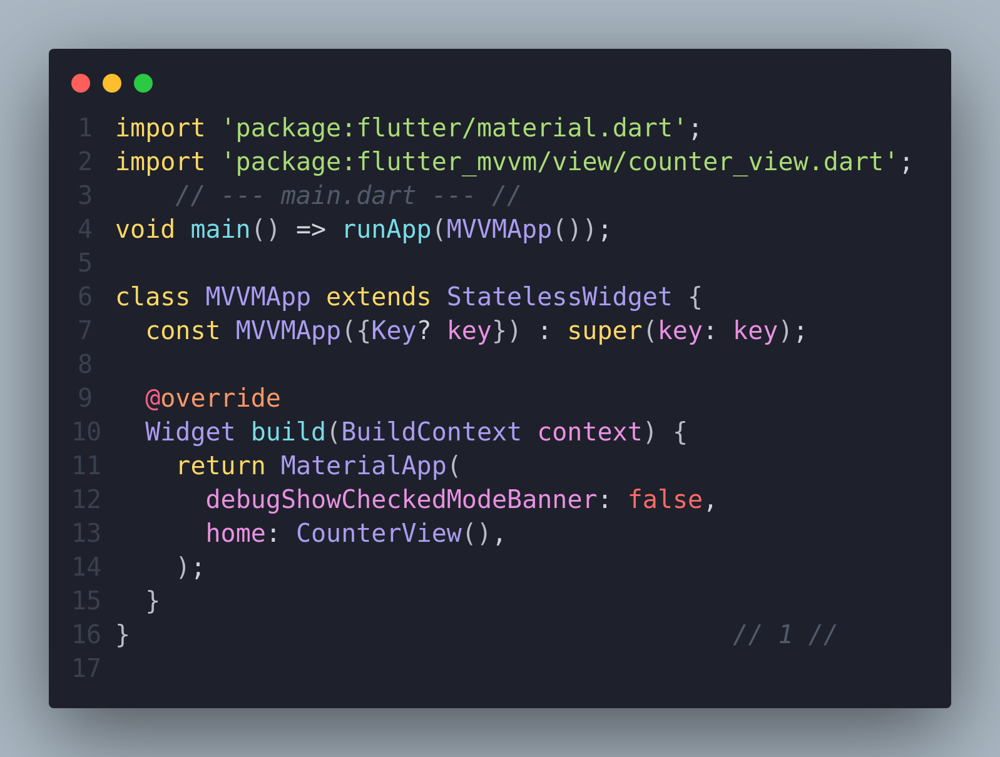
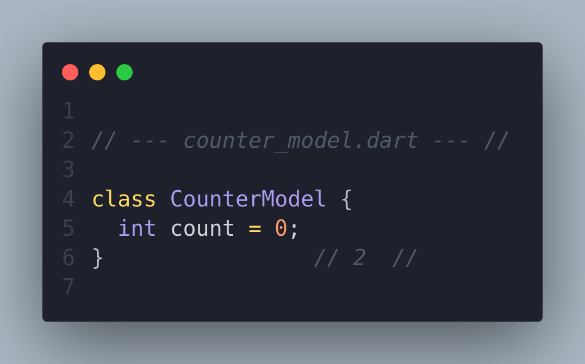
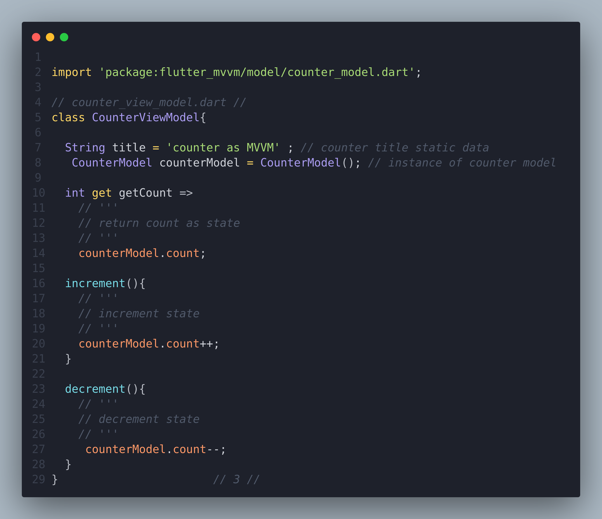
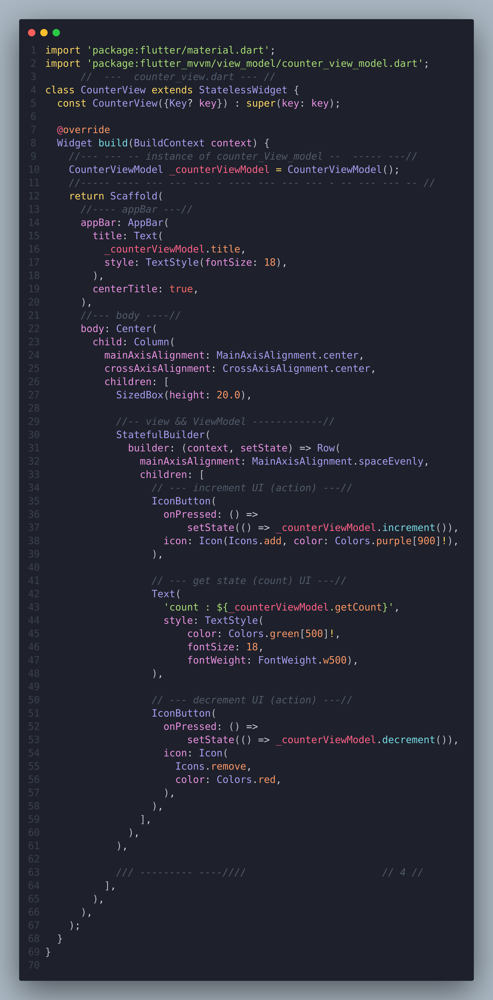

# Flutter MVVM 🚀
 - Model - View - ViewModel 

# Defination 🚀
 - Model–view–viewmodel (MVVM) is a software architectural pattern : 
   - that facilitates the separation of the development of the **graphical user interface** (the view) 
   - from the development of the business logic or back-end logic 

# View & ViewModel 🚀
 - View inject viewModel or create instance from ViewModel .
 - View send action to viewModel .
 - ViewModel send state(date) to View .  

# ViewModel && Model 🚀
 - Create instance from model in viewModel .
 - ( Business Logic or presentation logic ) in ViewModel .

# picture of counter 🚀








# how to switch github branch 👍
```
git checkout -b posts_mvvm
git push --set-upstream origin posts_mvvm
```